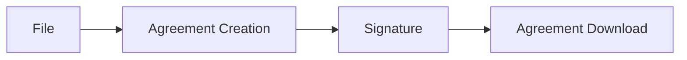

## eSignature

Electronic Signature application for Dodock/Dokos.
Compatible version:
- Version 3.x.x

This application is also compatible with Frappe version 14.

🚧 Application not ready for production 🏗️

## Integrations

### Adobe Sign

This application can be used to sign documents with Adobe Sign.

#### License

GNU GPLv3