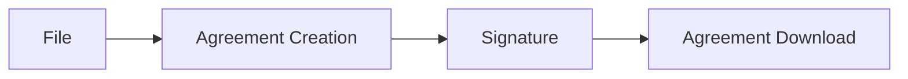

# eSignature 

## :hammer_and_wrench: How the eSignature directory works

Electronic Signature application for Dodock/Dokos.
Compatible version:
- Version 3.x.x

This application is also compatible with Frappe version 14.

🚧 Application not ready for production 🏗️

### Integrations

#### Adobe Sign

This application can be used to sign documents with Adobe Sign.

## :rocket: Dokos project 

Dokos is a 100% open-source management software that is based on ERPNext.

It is distributed under the GPLv3 license.

The 100% web architecture of Dokos allows you to use it in a public cloud as well as in a private cloud.

You can install it on your own servers.

The Dodock framework on which Dokos is installed also allows the installation of other applications. You can thus develop your own customizations, host them on your server and make them evolve in parallel with Dokos, without modifying its source code.

## :books: Use and documentation

#### Installation and use :construction:

##### 1. Documentation to set up Dokos eSignature : [eSignature documentation](https://doc.dokos.io/fr/esignature)

##### 2. Access to the Dokos community: [Forum](https://community.dokos.io/)

#### How to contribute :rocket:

**Description of the process and the branches to use**

1. I create a ticket with my proposal

- if it is for a new feature

- if a discussion is needed before making a Merge Request

2. I propose a Merge Request with my fixes/new features

3. The merge request must always be proposed on the develop branch and a retrofit request must be made in the merge request description

4. The merge request must contain a complete description and possibly screenshots

5. If a documentation is needed, it must be created on the wiki before the Merge Request is sent for validation

:point_right: Link to submit a ticket: **[Here](https://gitlab.com/dokos/dokos/-/issues)**

### :link: Useful links

- Detailed documentation: [doc.dokos.io](https://doc.dokos.io/fr/home)

- Community forum: [community.dokos.io](https://community.dokos.io/)

- Youtube channel: [Dokos Youtube](https://www.youtube.com/channel/UC2f3m8QANAVfKi2Pzw2fBlw)

- The Facebook page: [Dokos Facebook](https://www.facebook.com/dokos.io)

- The Linkedin page: [Dokos Linkedin](https://www.linkedin.com/company/dokos.io)

### :grey_question: Others informations

#### Website :card_index_dividers:

For details and documentation, see the website

[https://dokos.io](https://dokos.io)

#### License :page_facing_up:

This repository has been released under the [GNU-GPLv3](LICENSE).

#### Publisher :pushpin:

Dokos SAS
